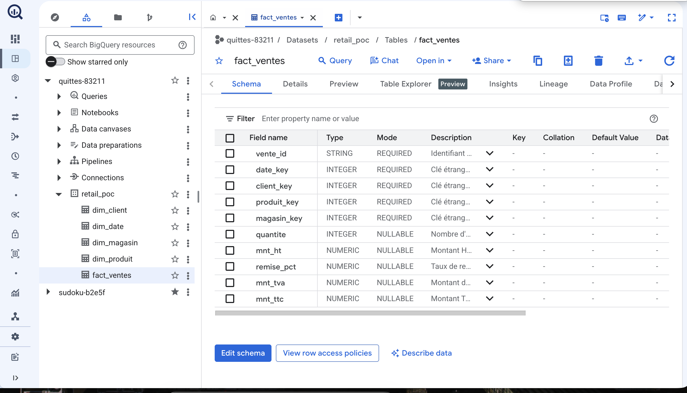

# KnowledgeCatalog — POC Dataplex → Agent conversationnel BigQuery

> D'un **schéma en étoile** BigQuery, on crée le **catalogue Dataplex** (descriptions,
> lineage, profiling, qualité), puis un **agent conversationnel** qui répond en
> langage naturel en s'appuyant sur ce catalogue.

## En une phrase

**Dataplex Universal Catalog** n'est pas l'agent : c'est la **couche de
métadonnées & gouvernance** qui rend l'agent *fiable*. L'agent lit les
**descriptions** des tables/colonnes (gérées via Dataplex, stockées sur BigQuery)
pour transformer une question en français en **SQL correct**.

```
 Projet BI (dbt / Dataform / SQL)
        │  crée des tables
        ▼
   BigQuery  ── schéma en étoile ──►  fact_ventes + dim_*
        │
        │  Dataplex récupère les métadonnées
        ▼
 Dataplex Universal Catalog
   • descriptions (auto-générables par Gemini)   ← ce que l'agent LIT
   • lineage (quelle requête a produit quoi)     ← "doc du code"
   • profiling + qualité                         ← valeurs & confiance
   • glossaire métier                            ← synonymes
        │  ces métadonnées = le "contexte"
        ▼
 Agent conversationnel (Conversational Analytics API)
   « Quel est le CA des clients actifs en 2025 ? »  →  SQL  →  réponse
```

### Le catalogue, vu dans BigQuery (capture réelle)



*Capture réelle du projet `quittes-83211`. La colonne **Description** est ce que l'agent
lit pour comprendre les tables — sans elle, il est aveugle. Ici `mnt_ht` porte la
description « … LE CHIFFRE D'AFFAIRES (CA) = SUM(mnt_ht) », que l'agent a effectivement
utilisée pour générer son SQL (voir [le run réel](docs/RUN-REEL-2026-07-07.md)).*

## Contenu du repo

| Dossier | Rôle |
|---|---|
| [`docs/`](docs/) | La théorie : concepts, architecture, **comment l'agent interagit avec le catalogue**, guide pas-à-pas |
| [`sql/`](sql/) | Le **schéma en étoile** + données de démo + **descriptions** (le catalogue) |
| [`scripts/`](scripts/) | Scripts `gcloud`/`bq` : dataset, lineage, scans profiling/qualité |
| [`agent/`](agent/) | Le code Python : lit le catalogue → construit le contexte → crée et interroge l'agent |
| [`assets/`](assets/) | Diagramme d'architecture + maquette illustrative de l'agent |

## Démarrage rapide

Prérequis : un projet **GCP avec facturation**, le **Google Cloud SDK** (`gcloud`, `bq`)
et **Python 3.10+**.

```bash
# 1) Config
cp .env.example .env      # renseigne PROJECT_ID + régions

# 2) Infra + données + catalogue (BigQuery + Dataplex)
bash scripts/run_all.sh

# 3) L'agent
cd agent
python3 -m venv .venv && source .venv/bin/activate
pip install -r requirements.txt
python build_context.py                                   # catalogue -> contexte
python create_agent.py                                    # crée l'agent
python ask.py "Quel est le CA des clients actifs en 2025 ?"
```

## Questions de démo à poser à l'agent

- « Quel est le chiffre d'affaires total en 2025 ? »
- « Top 5 des produits par CA sur le canal Online »
- « Combien de clients actifs par segment ? »
- « Compare le CA physique vs online par trimestre »

Chacune force l'agent à utiliser une description précise du catalogue
(CA = `SUM(mnt_ht)`, client actif = `statut='A'`, canal = `type_magasin`…).

## À lire dans l'ordre

1. [docs/01-concepts.md](docs/01-concepts.md) — c'est quoi Dataplex, vraiment
2. [docs/02-architecture.md](docs/02-architecture.md) — le flux de bout en bout
3. [docs/03-agent-catalog-interaction.md](docs/03-agent-catalog-interaction.md) — **comment l'agent lit le catalogue**
4. [docs/04-poc-guide.md](docs/04-poc-guide.md) — pas-à-pas + **quelles captures d'écran prendre**

> ✅ **POC exécuté en vrai** le 7 juillet 2026 sur le projet `quittes-83211`
> (BigQuery + Dataplex + agent Gemini). Résultats réels — SQL généré par l'agent,
> réponse, scans qualité « Passed » — dans [docs/RUN-REEL-2026-07-07.md](docs/RUN-REEL-2026-07-07.md).
> Le guide [docs/04-poc-guide.md](docs/04-poc-guide.md) indique quelles captures prendre.
