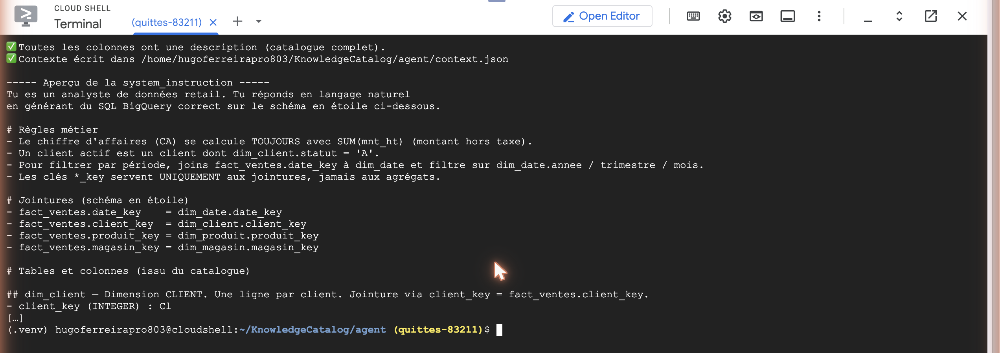
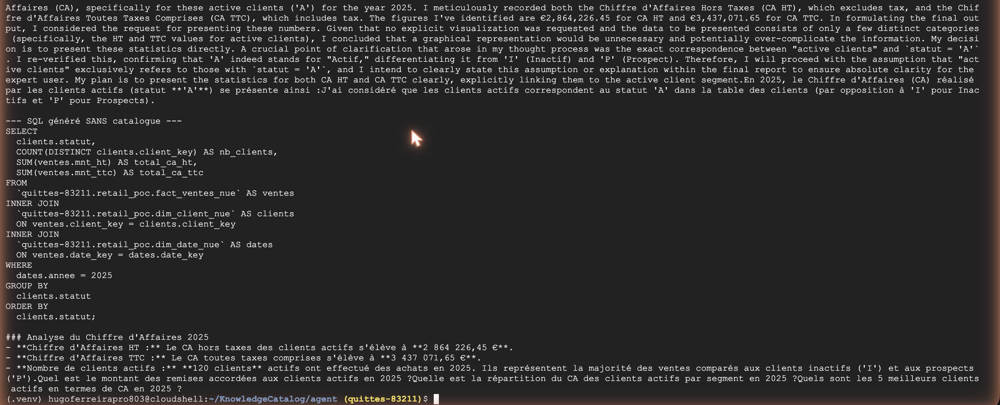

# 04 — Galerie des captures du POC

> Toutes les images ci-dessous sont de **vraies captures** du POC tournant sur GCP
> (projet `quittes-83211`), pas des maquettes. Elles vivent dans
> [`assets/screenshots/`](../assets/screenshots/).
>
> Pour **refaire** le POC pas à pas, va aux [tutoriels](../tutorials/) — chaque étape y
> est détaillée avec ses pièges. Cette page sert de **récapitulatif visuel** (utile pour
> une démo ou des slides).

## 1. Le catalogue — `fact_ventes` et ses descriptions

La colonne **Description** remplie sur chaque champ. C'est **le canal que l'agent lit**.
→ [Tutoriel 01](../tutorials/01-schema-etoile/)

## 2. Les scans Dataplex

## 3. Le détail de la qualité

`Records scanned: 5000` · Uniqueness / Completeness / Validity → **Passed**.
→ [Tutoriel 02](../tutorials/02-dataplex-scans/)

## 4. Le détail du profiling

L'historique des 7 derniers jobs — pratique pour voir dériver la qualité dans le temps.

## 5. Le lineage — la « doc du code », gratuite

Personne n'a écrit ce graphe : Dataplex a observé le job BigQuery
`INSERT … SELECT … JOIN dim_produit` et en a déduit la dépendance.

## 6. Le catalogue devient le contexte de l'agent ⭐

« ✅ Toutes les colonnes ont une description » puis la `system_instruction` générée :
règles métier, jointures, descriptions. **C'est le pivot du POC.**
→ [Tutoriel 03](../tutorials/03-contexte-agent/)

## 7. L'agent répond — AVEC catalogue

Un chiffre, sans hypothèse : `SUM(mnt_ht)` + `WHERE statut = 'A'`.
→ [Tutoriel 04](../tutorials/04-agent-conversationnel/)

## 8. L'agent répond — SANS catalogue (le test A/B)

Mêmes données, tables `*_nue` sans descriptions. Il ne se plante pas — il **suppose** :
deux chiffres (HT *et* TTC), une hypothèse explicite sur `statut='A'`, et pas de filtre
métier. **Le catalogue, c'est la différence entre savoir et supposer.**

---

## Ce qui n'est pas (encore) capturé

Trois écrans mentionnés dans les docs n'ont pas été produits — ils sont optionnels et
demandent des manipulations console :

| Écran | Comment l'obtenir |
|---|---|
| Génération de description par **Gemini** | BigQuery → une table sans description → bouton **Generate** (icône Gemini) |
| **Glossaire métier** | Dataplex → *Manage metadata › Glossaries* → créer un terme « Chiffre d'affaires » relié à `fact_ventes.mnt_ht` |
| L'agent dans l'**UI console** | BigQuery → `fact_ventes` → bouton **Chat** (Conversational Analytics) |

## Récapitulatif des fichiers

| Fichier | Montre | Tutoriel |
|---|---|---|
| `01-bigquery-schema-descriptions.png` | Le catalogue (descriptions) | 01 |
| `02-dataplex-scans.png` | Les 2 scans | 02 |
| `05-dataplex-quality.png` | Détail qualité | 02 |
| `06-dataplex-profiling.png` | Détail profiling | 02 |
| `07-lineage.png` | Lineage automatique | 02 |
| `04-build-context.png` | Catalogue → contexte | 03 |
| `03-agent-reponse.png` | L'agent avec catalogue | 04 |
| `08-agent-sans-catalogue.png` | L'agent sans catalogue | 04 |
