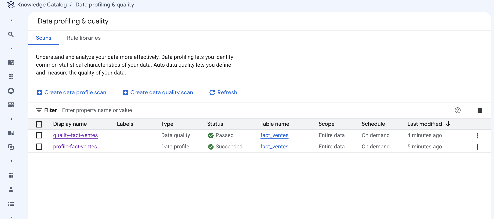
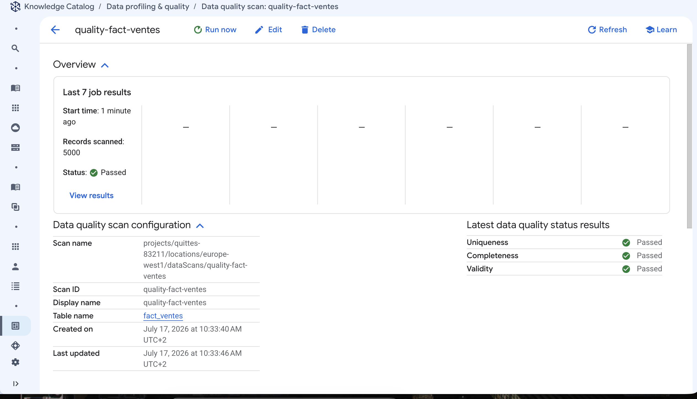
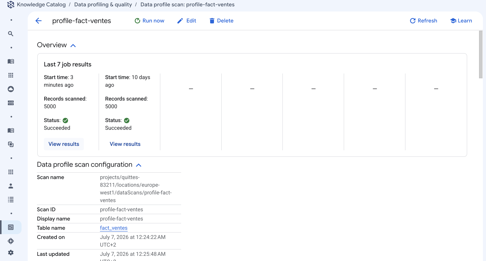
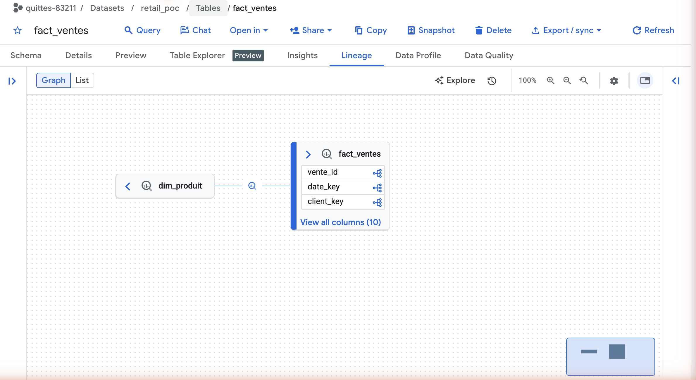

# Tutoriel 02 — Dataplex : lineage, profiling, qualité

⏱️ ~15 min · 🎯 Faire tourner un scan de profiling et un scan de qualité, et lire le lineage.

## Objectif

Ajouter les trois briques de gouvernance autour du catalogue :

| Brique | Ce que ça apporte | Utile à l'agent ? |
|---|---|---|
| **Lineage** | « d'où vient `fact_ventes` » — automatique | ❌ Non (c'est pour **toi**) |
| **Profiling** | valeurs réelles : min/max, nulls, top valeurs | ➖ Indirect (tu injectes les valeurs d'exemple dans le contexte) |
| **Qualité** | règles PASS/FAIL (unicité, plages) | ➖ Indirect (confiance) |

> ⚠️ **À bien comprendre** : aucune de ces trois briques n'est lue automatiquement par
> l'agent. Elles servent la **gouvernance** et t'aident à écrire un meilleur contexte.
> Le canal automatique reste la **description** (tutoriel 01).

## Prérequis

[Tutoriel 01](../01-schema-etoile/) terminé (5 000 lignes dans `fact_ventes`).

## Étapes

### 1. Lancer les scans

```bash
bash scripts/02_dataplex_scans.sh
```

Le script crée puis exécute :
- `profile-fact-ventes` (data profile)
- `quality-fact-ventes` (data quality, règles de [`scripts/dq_spec.yaml`](../../scripts/dq_spec.yaml))

> ⏳ **Sois patient** : la création du **premier** scan après activation de l'API prend
> facilement 30 à 60 s sans afficher grand-chose. C'est normal.

### 2. Comprendre les règles de qualité

[`scripts/dq_spec.yaml`](../../scripts/dq_spec.yaml) :

```yaml
- column: vente_id
  dimension: UNIQUENESS        # pas de doublon de ligne de commande
  uniquenessExpectation: {}
- column: mnt_ht
  dimension: VALIDITY
  rangeExpectation:
    minValue: "0"              # un CA de ligne n'est jamais négatif
- column: remise_pct
  dimension: VALIDITY
  rangeExpectation:
    minValue: "0"
    maxValue: "1"              # la remise est une fraction, pas un %
```

### 3. Le lineage (rien à faire)

Le lineage BigQuery est **automatique** dès que `datalineage.googleapis.com` est activé
(fait au tutoriel 00). Il se remplit tout seul à mesure que des requêtes tournent.

## Résultat attendu

```
▶ Scan de PROFILING sur fact_ventes…
  state: ACTIVE / type: DATA_PROFILE
  job: … state: PENDING
▶ Scan de QUALITÉ sur fact_ventes (règles dq_spec.yaml)…
  job: … state: PENDING / type: DATA_QUALITY
✅ Scans lancés.
```

Les jobs tournent **en asynchrone** : compte ~2 min avant d'avoir les résultats.

## Vérifier

### 1. Les deux scans sont passés

Console → **Dataplex (« Knowledge Catalog ») › Govern › Data profiling & quality** :



`profile-fact-ventes` → **Succeeded** et `quality-fact-ventes` → **Passed**.

### 2. Le détail de la qualité

Clique sur `quality-fact-ventes` :



`Records scanned: 5000`, `Status: Passed`, et les 3 dimensions **Uniqueness /
Completeness / Validity** toutes vertes. Ce sont exactement les règles de `dq_spec.yaml`.

### 3. Le détail du profiling

Clique sur `profile-fact-ventes` → **View results** pour les stats par colonne :



L'historique garde les **7 derniers jobs** — pratique pour voir dériver la qualité dans
le temps.

### 4. Le lineage — la « doc du code », gratuite

`fact_ventes` → onglet **Lineage** dans BigQuery :



👉 **Personne n'a écrit ce graphe.** Il vient du `INSERT … SELECT … JOIN dim_produit` du
[tutoriel 01](../01-schema-etoile/) : Dataplex a observé le job BigQuery et en a déduit
que `dim_produit` alimente `fact_ventes`. C'est *ça*, « documenter le code
automatiquement ».

> ⏳ Le graphe peut rester vide quelques minutes après le chargement — le lineage est
> asynchrone. Sur ce POC, l'amont n'est apparu qu'après coup.

## Pièges connus

| Symptôme | Cause | Solution |
|---|---|---|
| Le script semble figé sur « Scan de PROFILING… » | Création du 1er datascan = lente | Attendre 30-60 s |
| Onglet **Data Profile** de BigQuery : *« Data profiling results not published for this table »* | Notre scan **ne publie pas** ses résultats vers BigQuery | Normal. Les résultats sont dans la **console Dataplex**. Pour les publier, recréer le scan avec l'option de publication |
| Le graphe de **lineage** ne montre que `fact_ventes`, sans amont | Le lineage est **asynchrone** | Attendre quelques minutes puis rafraîchir |
| `INVALID_ARGUMENT` à la création du scan | Région du scan ≠ région du dataset | Aligner `DPLX_LOCATION` sur `BQ_LOCATION` |

## Suite

➡️ [Tutoriel 03 — Du catalogue au contexte de l'agent](../03-contexte-agent/)
