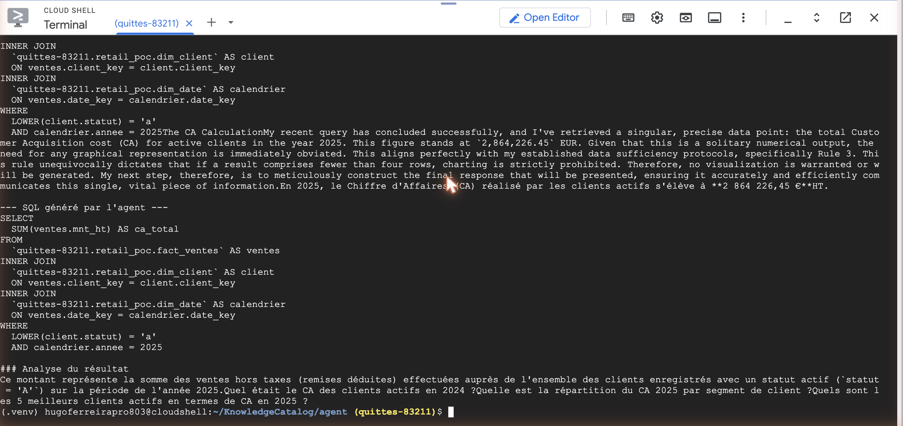

# Tutoriel 04 — L'agent conversationnel

⏱️ ~15 min · 🎯 Créer l'agent, lui poser une question en français, et voir qu'il utilise le catalogue.

## Objectif

La récompense. Tu crées un agent (Conversational Analytics API) avec le contexte du
tutoriel 03, tu lui demandes le CA, et tu constates qu'il génère le **bon SQL** —
parce qu'il a lu tes descriptions.

## Prérequis

[Tutoriel 03](../03-contexte-agent/) terminé (`agent/context.json` existe, venv actif).

## Étapes

### 1. Créer l'agent

```bash
python create_agent.py
```

Ce que fait [`create_agent.py`](../../agent/create_agent.py) : il donne à l'agent
**deux choses**, et rien d'autre.

```python
# 1) Sur quelles tables il a le droit de générer du SQL
datasources.bq.table_references = table_refs

# 2) Le contexte issu du catalogue
published.system_instruction = ctx["system_instruction"]
published.datasource_references = datasources
```

### 2. Poser une question

```bash
python ask.py "Quel est le CA des clients actifs en 2025 ?"
```

### 3. D'autres questions à essayer

```bash
python ask.py "Top 5 des produits par CA sur le canal Online"
python ask.py "Combien de clients actifs par segment ?"
python ask.py --inline "Compare le CA physique vs online par trimestre"
```

`--inline` passe le contexte directement, sans agent persistant — pratique pour itérer.

## Résultat attendu

Résultat **réel** obtenu le 7 juillet 2026 :

```
--- SQL généré par l'agent ---
SELECT
  SUM(fact_ventes.mnt_ht) AS chiffre_affaires
FROM `…retail_poc.fact_ventes` AS fact_ventes
INNER JOIN `…retail_poc.dim_client` AS dim_client
  ON fact_ventes.client_key = dim_client.client_key
INNER JOIN `…retail_poc.dim_date` AS dim_date
  ON fact_ventes.date_key = dim_date.date_key
WHERE dim_client.statut = 'A'
  AND dim_date.annee = 2025;

### Analyse du Chiffre d'Affaires 2025
En 2025, le chiffre d'affaires total réalisé auprès des clients actifs s'élève à
**2 864 226,45 € HT**. …
```



*Capture réelle (re-run du 17 juillet 2026). On y voit le SQL généré par l'agent puis sa
réponse : « le Chiffre d'Affaires (CA) réalisé par les clients actifs s'élève à
**2 864 226,45 €** HT ».*

> 💡 **Détail instructif** : ce re-run, 10 jours après le premier, redonne **exactement
> le même montant** — mais écrit le SQL autrement (alias `ventes`/`client`/`calendrier`,
> et `LOWER(client.statut) = 'a'` au lieu de `statut = 'A'`). L'agent n'est **pas
> déterministe dans la forme**, mais le catalogue le contraint sur le **sens** : bonne
> colonne, bon filtre, bon résultat. C'est exactement ce qu'on attend d'un bon contexte.
>
> Amusant : dans son raisonnement interne (en anglais), il traduit « CA » par *« Customer
> Acquisition cost »* — mais son SQL et sa réponse française restent justes, parce que la
> **description de `mnt_ht`** lui donne la formule sans ambiguïté. La description ancre
> le modèle même quand sa prose dérive.

## 🔍 La preuve — l'agent cite le catalogue

Dans son raisonnement, l'agent a écrit (verbatim) :

> *"I've also double-checked the specific rules provided: **'Le chiffre d'affaires (CA)
> se calcule TOUJOURS avec SUM(mnt_ht)'** — this crucial metadata dictates how the
> revenue is calculated. **'Un client actif est un client dont dim_client.statut = A'**
> — this definition is fundamental […] and was correctly applied."*

👉 Trois choses à remarquer dans le SQL :
1. `SUM(mnt_ht)` et pas `mnt_ttc` → il a lu la description de `mnt_ht`.
2. `statut = 'A'` → il a lu la description de `statut`.
3. Les `INNER JOIN` corrects → il a lu les jointures du contexte.

**Rien de tout ça n'est deviné.** Tout vient du catalogue.

## Vérifier

Le meilleur test — le **avant / après** :

```sql
-- 1) Une copie SANS descriptions (CTAS ne copie pas les descriptions)
CREATE TABLE `ton-projet.retail_poc.fact_ventes_nue` AS
SELECT * FROM `ton-projet.retail_poc.fact_ventes`;
```

Pointe un agent inline sur `fact_ventes_nue` et redemande le CA : il hésite, prend la
mauvaise colonne, ou demande des précisions. **Mêmes données, la seule différence est
le catalogue.** C'est l'argument qui convainc en réunion.

## Pièges connus

| Symptôme | Cause | Solution |
|---|---|---|
| `PermissionDenied` / `403` sur `geminidataanalytics` | API non activée ou facturation absente | [Tutoriel 00](../00-prerequis/) |
| `AlreadyExists` | L'agent existe déjà | Normal : `create_agent.py` bascule en `update` |
| Sortie vide de `ask.py` | Noms de champs de l'API modifiés | `DEBUG=1 python ask.py "…"` pour voir le flux brut |
| L'agent répond à côté | Descriptions trop vagues | Enrichis les descriptions ([tutoriel 01](../01-schema-etoile/)) puis **rejoue le [tutoriel 03](../03-contexte-agent/)** |

## Suite

➡️ [Tutoriel 05 — Maintenir le catalogue](../05-maintenir-le-catalogue/) — parce qu'un
catalogue qui vieillit produit un agent qui se trompe.
